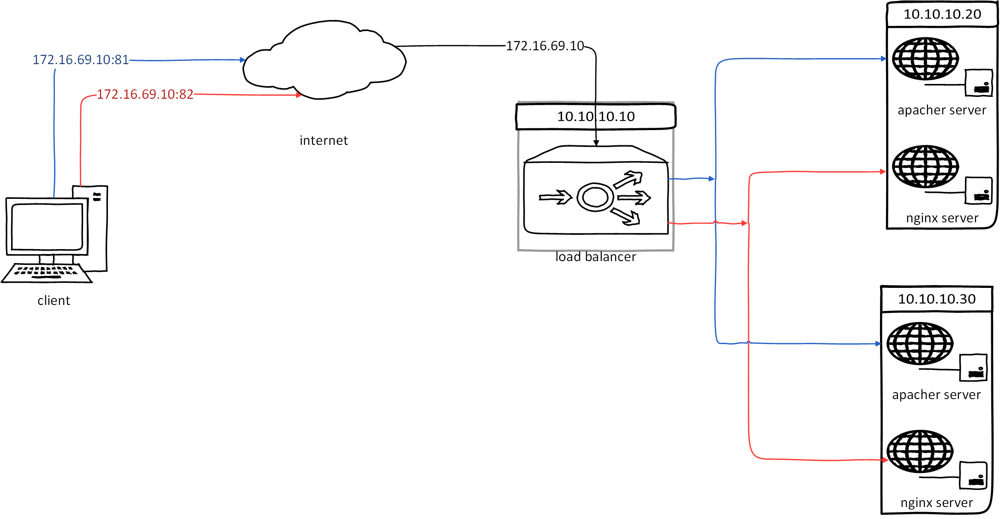

# Cấu hình Nginx Multiple Upstream.

## I. Mô hình.

   > 

## II. Cài đặt và cấu hình.

### 1. Trên node Load Balancing.

- Thêm repo nginx:

  ```sh
  yum install epel-release
  ```

- Cài đặt nginx :

    ```sh
    yum install nginx

    ```

- Khởi động nginx :

    ```sh
    systemctl start nginx
    ```

- Khởi động `firewall-cmd` :

    ```sh
    systemctl start firewalld
    systemctl enable firewalld
    ```

- Cấu hình firewall  và restart lại dịch vụ:

    ```sh
    sudo firewall-cmd --permanent --zone=public --add-service=http 
    sudo firewall-cmd --permanent --zone=public --add-service=https
    sudo firewall-cmd --reload

    ```

- Dùng trình soạn thảo `vi` mở file `/etc/nginx/nginx.conf` :

    ```sh
    vi /etc/nginx/nginx.conf
    ```

- Tìm và comment dòng sau :

    ```sh
    # listen       [::]:80 default_server;
    ```

- Chuyển đến thư mục `conf.d` của Nginx  :

    ```sh
    cd /etc/nginx/conf.d
    ```

- Tại ra 2 file là `lbapache.conf` và `lbnginx.conf` :

    ```sh
    touch lbapache.conf
    touch lbnginx.conf
    ```

- Mở file `lbapache.conf` và thêm vào nội dung sau :

    ```sh
    upstream lbapache {
        server 10.10.10.20:81;
        server 10.10.10.30:81;
    }
    
    server {
        listen 81;
        server_name _;
        location / {
            proxy_pass http://lbapache;
        }
    }

    ```

- Mở file `lbnginx.conf` và thêm vào nội dung sau :

    ```sh
    upstream lbnginx {
        server 10.10.10.20:82;
        server 10.10.10.30:82;
    }
    
    server {
        listen 82;
        server_name _;
        location / {
            proxy_pass http://lbnginx;
        }
    }

    ```

- Mở port 81 và 82 :


    ```sh
    firewall-cmd --zone=public --add-port=81/tcp
    firewall-cmd --zone=public --add-port=82/tcp
    ```

- Restart lai dịch vụ :

    ```sh
    systemctl restart nginx
    ```

- Nếu như có lỗi xảy ra do SElinux chúng ta thực hiện các lệnh sau để sửa lỗi :

    ```sh
    yum install -y policycoreutils-devel

    grep nginx /var/log/audit/audit.log | audit2allow -M nginx

    semodule -i nginx.pp
    ```

    hoặc sửa nội dung của file */etc/selinux/config* bằng việc thay *enforcing* thành "disabled"

- Sau đó restart lại dịch vụ :

    ```sh
    systemctl restart nginx
    ```

### 2. Trên các node web server .

- Thêm repo nginx:

  ```sh
  yum install epel-release
  ```

- Cài đặt nginx :

    ```sh
    yum install nginx

    ```

- Khởi động nginx :

    ```sh
    systemctl start nginx
    systemctl enable nginx
    ```
- Cấu hình port
    + Sửa file cấu hình */etc/nginx/conf.d/web82.conf*:

            vi /etc/nginx/conf.d/web82.conf

        thêm nội dung sau vào file trên:
            
            allow 10.10.10.10;
            deny all;
            server {
                listen 82;
                server_name _;
                root /usr/share/nginx/html;
                    index index.php index.html index.cgi;
                location / {

                }
            }
- Khởi động `firewall-cmd` :

    ```sh
    systemctl start firewalld
    systemctl enable firewalld
    ```

- Cấu hình firewall  và restart lại dịch vụ:

    ```sh
    sudo firewall-cmd --permanent --zone=public --add-service=http 
    sudo firewall-cmd --permanent --zone=public --add-service=https
    sudo firewall-cmd --reload

    ```

- Cài đặt apache :

    ```sh
    yum install httpd httpd-devel -y
    ```

- Dùng trình soạn thảo `vi` để mở file `/etc/httpd/conf/httpd.conf`

    ```sh
    vi /etc/httpd/conf/httpd.conf
    ```

- Tìm và sửa lại các dòng sau :

    ```sh
    Listen 81
    ServerName www.example.com:81
    ```

- Sau đó mở port 81, 82 trên server :

    ```sh
    firewall-cmd --zone=public --add-port=81/tcp
    firewall-cmd --zone=public --add-port=82/tcp
    ```
- Restart lại dịch vụ :

    ```sh
    systemctl restart httpd
    ```

- Như thế là đã thành công rồi :D
